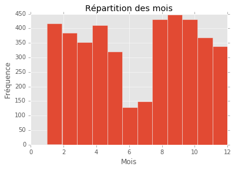
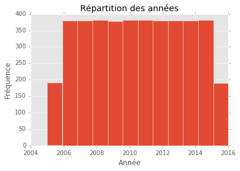
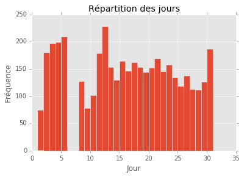
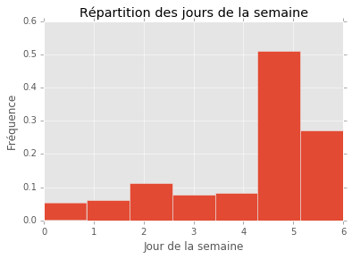

Importons les libraires classiques de Python d'analyse de données :
- numpy : manipulation de vecteurs, matrices, ...
- pandas : manipulation générale de données (dataframe par exemple),
- glob : pour les repértoires de fichier,
- matplotlib : graphiques

La dernière ligne est une option et force matplotlib à afficher les graphiques dans ce document.


```python
import numpy as np
import pandas as pd
from glob import glob
import matplotlib.pyplot as plt
%matplotlib inline
plt.style.use('ggplot')
```

# 1. Analyse descriptive des données Ligue 1 Foot

Nous souhaitons analyser les données de Ligue 1 de Foot de 2005 à 2016. Elles sont disponibles à cette adresse : http://www.football-data.co.uk/francem.php.

## 1.1 Import donnees

Sur le lien précédent les fichiers sont téléchargables saison par saison. Au lieu de manuellement fusionner les fichiers dans Excel, ce qui peut être source d'erreurs, il est préférable de programmer l'import et la concaténation automatique de tous les fichiers.
La fonction glob du package Python glob permet de récupérer tous les fichiers d'un répertoire selon des critères, par exemple dont l'extension est _csv_.


```python
chemin = r'C:\Users\AVISIA\Documents\Data'
fichiers = glob(chemin + '/*.csv')

list_ = []
for file in fichiers:
    list_.append(pd.read_csv(file))
data = pd.concat(list_)
```


```python
data.head()
```


<div>
<table border="1" class="dataframe">
  <thead>
    <tr style="text-align: right;">
      <th></th>
      <th>AC</th>
      <th>AF</th>
      <th>AR</th>
      <th>AS</th>
      <th>AST</th>
      <th>AY</th>
      <th>AwayTeam</th>
      <th>B365A</th>
      <th>B365D</th>
      <th>B365H</th>
      <th>...</th>
      <th>SBH</th>
      <th>SJA</th>
      <th>SJD</th>
      <th>SJH</th>
      <th>VCA</th>
      <th>VCD</th>
      <th>VCH</th>
      <th>WHA</th>
      <th>WHD</th>
      <th>WHH</th>
    </tr>
  </thead>
  <tbody>
    <tr>
      <th>0</th>
      <td>NaN</td>
      <td>NaN</td>
      <td>0</td>
      <td>11.0</td>
      <td>7.0</td>
      <td>3</td>
      <td>Metz</td>
      <td>6.50</td>
      <td>3.4</td>
      <td>1.50</td>
      <td>...</td>
      <td>1.53</td>
      <td>7.00</td>
      <td>3.50</td>
      <td>1.50</td>
      <td>7.00</td>
      <td>3.40</td>
      <td>1.50</td>
      <td>6.5</td>
      <td>3.30</td>
      <td>1.50</td>
    </tr>
    <tr>
      <th>1</th>
      <td>NaN</td>
      <td>NaN</td>
      <td>0</td>
      <td>8.0</td>
      <td>5.0</td>
      <td>3</td>
      <td>Rennes</td>
      <td>4.33</td>
      <td>3.0</td>
      <td>1.80</td>
      <td>...</td>
      <td>1.83</td>
      <td>4.00</td>
      <td>2.88</td>
      <td>2.00</td>
      <td>4.35</td>
      <td>3.00</td>
      <td>1.85</td>
      <td>4.0</td>
      <td>3.00</td>
      <td>1.83</td>
    </tr>
    <tr>
      <th>2</th>
      <td>NaN</td>
      <td>NaN</td>
      <td>0</td>
      <td>9.0</td>
      <td>4.0</td>
      <td>4</td>
      <td>Bordeaux</td>
      <td>4.50</td>
      <td>3.2</td>
      <td>1.72</td>
      <td>...</td>
      <td>1.67</td>
      <td>4.75</td>
      <td>3.20</td>
      <td>1.73</td>
      <td>5.00</td>
      <td>3.00</td>
      <td>1.75</td>
      <td>5.0</td>
      <td>3.10</td>
      <td>1.66</td>
    </tr>
    <tr>
      <th>3</th>
      <td>NaN</td>
      <td>NaN</td>
      <td>0</td>
      <td>5.0</td>
      <td>3.0</td>
      <td>2</td>
      <td>Monaco</td>
      <td>1.90</td>
      <td>3.1</td>
      <td>3.75</td>
      <td>...</td>
      <td>3.60</td>
      <td>1.91</td>
      <td>3.10</td>
      <td>4.00</td>
      <td>2.00</td>
      <td>3.25</td>
      <td>3.75</td>
      <td>1.9</td>
      <td>2.87</td>
      <td>4.00</td>
    </tr>
    <tr>
      <th>4</th>
      <td>NaN</td>
      <td>NaN</td>
      <td>0</td>
      <td>10.0</td>
      <td>3.0</td>
      <td>3</td>
      <td>Lens</td>
      <td>3.00</td>
      <td>3.0</td>
      <td>2.25</td>
      <td>...</td>
      <td>2.20</td>
      <td>3.20</td>
      <td>3.00</td>
      <td>2.20</td>
      <td>3.20</td>
      <td>3.00</td>
      <td>2.20</td>
      <td>2.9</td>
      <td>2.90</td>
      <td>2.30</td>
    </tr>
  </tbody>
</table>
<p>5 rows × 73 columns</p>
</div>


## 1.2 Qualité des données

### 1.2.1 Valeurs manquantes

La méthode précédente semble produire des erreurs, des _NaN_, c'est-à-dire _Not a Number_.
Une piste envisagée serait que les fichiers n'ont pas la même structure.

Après inspection les colonnes _HF_, _AF_, _HC_, _AC_ (corners et fautes) ne sont pas présentes dans les fichiers moins récents. Il est possible de spécifier les colonnes à importer a priori.
Nous spécifions donc les colonnes présentes dans tous les fichiers et supprimons les colonnes inutiles (la 1e spécifiant 'Ligue1' et les autres relatives aux cotes).


```python
chemin = r'C:/Users/AVISIA/Documents/Data'
fichiers = glob(chemin + '/*.csv')
    
list_ = []
for file in fichiers:
    list_.append(pd.read_csv(file,
                             usecols = ['Date','HomeTeam','AwayTeam','FTHG','FTAG','FTR','HTHG','HTAG','HTR','HS','AS','HST',
                                        'AST','HY','AY','HR','AR']))
data = pd.concat(list_)
```

Vérifions qu'il n'y a plus de _NaN_.


```python
data.isnull().sum()
```


    Date        0
    HomeTeam    0
    AwayTeam    0
    FTHG        0
    FTAG        0
    FTR         0
    HTHG        0
    HTAG        0
    HTR         0
    HS          1
    AS          1
    HST         1
    AST         1
    HY          0
    AY          0
    HR          0
    AR          0
    dtype: int64


Récupérons la -les- ligne-s avec les erreurs.


```python
data.ix[data['HS'].isnull() | data['AS'].isnull() | data['HST'].isnull() | data['AST'].isnull()]
```


<div>
<table border="1" class="dataframe">
  <thead>
    <tr style="text-align: right;">
      <th></th>
      <th>Date</th>
      <th>HomeTeam</th>
      <th>AwayTeam</th>
      <th>FTHG</th>
      <th>FTAG</th>
      <th>FTR</th>
      <th>HTHG</th>
      <th>HTAG</th>
      <th>HTR</th>
      <th>HS</th>
      <th>AS</th>
      <th>HST</th>
      <th>AST</th>
      <th>HY</th>
      <th>AY</th>
      <th>HR</th>
      <th>AR</th>
    </tr>
  </thead>
  <tbody>
    <tr>
      <th>364</th>
      <td>06/05/06</td>
      <td>Nantes</td>
      <td>Bordeaux</td>
      <td>0</td>
      <td>1</td>
      <td>A</td>
      <td>0</td>
      <td>0</td>
      <td>D</td>
      <td>NaN</td>
      <td>NaN</td>
      <td>NaN</td>
      <td>NaN</td>
      <td>4</td>
      <td>2</td>
      <td>0</td>
      <td>0</td>
    </tr>
  </tbody>
</table>
</div>


Nous remarquons ici de manière nette qu'à une ligne correspond un match (fini) de Ligue 1 lors d'une saison régulière.

Il est nécessaire de récupérer les données sur une source externe (ici une vidéo) pour renseigner correctement les données.


```python
data.set_value(364, 'HS', 4)
data.set_value(364, 'AS', 3)
data.set_value(364, 'HST', 3)
data.set_value(364, 'AST', 1)
```

### 1.2.2 Traitement dates

La fonction *to_datetime* du package Pandas permet de détecter automatiquement le format de la colonne en entrée (ici un caractère de la forme JJ/MM/AA) et la convertir en format Date.


```python
data['Datetime'] = pd.to_datetime(data['Date'])
```

Vérifions le contenu de la colonne c'est-à-dire les années, mois et jours présents.

Mois :

On récupère d'abord le nombre de mois différents et le nombre de matchs par mois pendant toute la période.


```python
print(data['Datetime'].dt.month.nunique())
data['Datetime'].dt.month.value_counts()
```

    12
    


    9     448
    10    432
    8     432
    1     416
    4     410
    2     385
    11    368
    3     353
    12    338
    5     321
    7     149
    6     128
    Name: Datetime, dtype: int64


Pas très informatif... Essayons des histogrammes simples.

Notons qu'il vaut mieux spécifier le nombre de barres de l'histogramme afin d'éviter les regroupements arbitraires.


```python
plt.hist(data['Datetime'].dt.month, bins=12)
plt.xlabel('Mois')
plt.ylabel('Fréquence')
plt.title('Répartition des mois')
plt.show()
```





Il semble normal qu'il y ait moins de matchs pendant les mois de l'été.

Années :


```python
plt.hist(data['Datetime'].dt.year, bins=12)
plt.xlabel('Année')
plt.ylabel('Fréquence')
plt.title('Répartition des années')
plt.show()
```





La répartition des matchs selon les années semble correcte. Les 1er et dernier mois sont deux fois moins remplis étant donné que nous n'avons pas récupéré les matchs de l'année entière mais par saison (qui commence vers Août). Les autres années n'ont pas un nombre de mois égal étant donné que le calendrier de match peut se décaler légèrement d'une année à l'autre.

On peut vérifier dans les données qu'il y a bien 380 matchs par saison : 20 équipes qui se rencontrent chacune 2 fois : $ 20 * 19 = 380 $.


```python
plt.hist(data['Datetime'].dt.day, bins=range(1,32))
plt.xlabel('Jour')
plt.ylabel('Fréquence')
plt.title('Répartition des jours')
plt.show()
```





Hormis pour vérifier qu'il n'y a pas d'erreurs, ce n'est pas tant la répartition du jour du mois qui nous intéresse, mais plutôt la répartition des jours de la semaine.


```python
plt.hist(data['Datetime'].dt.weekday, bins=7, normed=True)
plt.xlabel('Jour de la semaine')
plt.ylabel('Fréquence')
plt.title('Répartition des jours de la semaine')
plt.show()
```





Assez logiquement la majorité des matchs se joue le week-end, et plus spécialement Samedi et Dimanche. Il y a par contre plus de matchs joués le Mercredi que le Vendredi.

### 1.2.3 Vérification des équipes

Vérifions que les équipes domiciles et extérieures sont cohérentes et qu'elles ont fait le bon nombre de matchs par saison.

Regardons d'abord toutes les équipes présentes dans le fichier.


```python
np.unique(np.vstack((data.HomeTeam.unique(), data.AwayTeam.unique())))
```


    array(['Ajaccio', 'Angers', 'Arles', 'Auxerre', 'Bastia', 'Bordeaux',
           'Boulogne', 'Brest', 'Caen', 'Dijon', 'Evian Thonon Gaillard',
           'Grenoble', 'Guingamp', 'Le Havre', 'Le Mans', 'Lens', 'Lille',
           'Lorient', 'Lyon', 'Marseille', 'Metz', 'Monaco', 'Montpellier',
           'Nancy', 'Nantes', 'Nice', 'Paris SG', 'Reims', 'Rennes', 'Sedan',
           'Sochaux', 'St Etienne', 'Strasbourg', 'Toulouse', 'Troyes',
           'Valenciennes'], dtype=object)


À part Ajaccio, il ne semble pas y avoir de problèmes dans les équipes. Modifions _Ajaccio GFCO_ en _Ajaccio_.


```python
data['HomeTeam'] = data['HomeTeam'].replace('Ajaccio GFCO','Ajaccio')
data['AwayTeam'] = data['AwayTeam'].replace('Ajaccio GFCO','Ajaccio')
```

## 1.3 Ajout de nouvelles informations

Afin de faciliter les analyses, il peut être utile de créer une colonne indiquant la saison pendant laquelle ont été effectués les matchs.
Il aurait été possible de rajouter cette information pendant l'import de données, mais privilégions une approche un peu plus complexe : étant donné qu'il y a 38 matchs par cette saison, il suffit de changer de saison après le 380e.


```python
data['Saison'] = np.array(range(0, 11*380)) // 380 + 1
```


```python
data.head()
```


<div>
<table border="1" class="dataframe">
  <thead>
    <tr style="text-align: right;">
      <th></th>
      <th>Date</th>
      <th>HomeTeam</th>
      <th>AwayTeam</th>
      <th>FTHG</th>
      <th>FTAG</th>
      <th>FTR</th>
      <th>HTHG</th>
      <th>HTAG</th>
      <th>HTR</th>
      <th>HS</th>
      <th>AS</th>
      <th>HST</th>
      <th>AST</th>
      <th>HY</th>
      <th>AY</th>
      <th>HR</th>
      <th>AR</th>
      <th>Datetime</th>
      <th>Saison</th>
    </tr>
  </thead>
  <tbody>
    <tr>
      <th>0</th>
      <td>29/07/05</td>
      <td>Paris SG</td>
      <td>Metz</td>
      <td>4</td>
      <td>1</td>
      <td>H</td>
      <td>2</td>
      <td>0</td>
      <td>H</td>
      <td>16.0</td>
      <td>11.0</td>
      <td>9.0</td>
      <td>7.0</td>
      <td>2</td>
      <td>3</td>
      <td>0</td>
      <td>0</td>
      <td>2005-07-29</td>
      <td>1</td>
    </tr>
    <tr>
      <th>1</th>
      <td>30/07/05</td>
      <td>Lille</td>
      <td>Rennes</td>
      <td>1</td>
      <td>0</td>
      <td>H</td>
      <td>1</td>
      <td>0</td>
      <td>H</td>
      <td>14.0</td>
      <td>8.0</td>
      <td>5.0</td>
      <td>5.0</td>
      <td>2</td>
      <td>3</td>
      <td>0</td>
      <td>0</td>
      <td>2005-07-30</td>
      <td>1</td>
    </tr>
    <tr>
      <th>2</th>
      <td>30/07/05</td>
      <td>Marseille</td>
      <td>Bordeaux</td>
      <td>0</td>
      <td>2</td>
      <td>A</td>
      <td>0</td>
      <td>1</td>
      <td>A</td>
      <td>7.0</td>
      <td>9.0</td>
      <td>3.0</td>
      <td>4.0</td>
      <td>2</td>
      <td>4</td>
      <td>1</td>
      <td>0</td>
      <td>2005-07-30</td>
      <td>1</td>
    </tr>
    <tr>
      <th>3</th>
      <td>30/07/05</td>
      <td>Nancy</td>
      <td>Monaco</td>
      <td>0</td>
      <td>1</td>
      <td>A</td>
      <td>0</td>
      <td>0</td>
      <td>D</td>
      <td>10.0</td>
      <td>5.0</td>
      <td>6.0</td>
      <td>3.0</td>
      <td>2</td>
      <td>2</td>
      <td>2</td>
      <td>0</td>
      <td>2005-07-30</td>
      <td>1</td>
    </tr>
    <tr>
      <th>4</th>
      <td>30/07/05</td>
      <td>Nantes</td>
      <td>Lens</td>
      <td>2</td>
      <td>0</td>
      <td>H</td>
      <td>2</td>
      <td>0</td>
      <td>H</td>
      <td>10.0</td>
      <td>10.0</td>
      <td>3.0</td>
      <td>3.0</td>
      <td>1</td>
      <td>3</td>
      <td>0</td>
      <td>0</td>
      <td>2005-07-30</td>
      <td>1</td>
    </tr>
  </tbody>
</table>
</div>


## 1.4 Analyse des données

### 1.4.1 Total des buts par équipe

Commençons par un simple cumul des buts marqués à domicile par chaque équipe


```python
data.groupby('HomeTeam').FTHG.sum().head()
```


    HomeTeam
    Ajaccio    102
    Angers      20
    Arles       14
    Auxerre    171
    Bastia     101
    Name: FTHG, dtype: int64


L'efficacité offensive telle que calculée n'est pas utile étant donné que chaque club a pu ne pas jouer en Ligue 1 pendant 1 ou plusieurs saisons


```python
efficacite = data.groupby('HomeTeam').agg({'FTHG': lambda x: x.sum()/x.count()}).reset_index()
```


```python
efficacite.sort_values(by = ['FTHG','HomeTeam'], ascending = [False, True])
```


<div>
<table border="1" class="dataframe">
  <thead>
    <tr style="text-align: right;">
      <th></th>
      <th>HomeTeam</th>
      <th>FTHG</th>
    </tr>
  </thead>
  <tbody>
    <tr>
      <th>26</th>
      <td>Paris SG</td>
      <td>1.971292</td>
    </tr>
    <tr>
      <th>18</th>
      <td>Lyon</td>
      <td>1.937799</td>
    </tr>
    <tr>
      <th>16</th>
      <td>Lille</td>
      <td>1.712919</td>
    </tr>
    <tr>
      <th>19</th>
      <td>Marseille</td>
      <td>1.679426</td>
    </tr>
    <tr>
      <th>5</th>
      <td>Bordeaux</td>
      <td>1.502392</td>
    </tr>
    <tr>
      <th>22</th>
      <td>Montpellier</td>
      <td>1.451128</td>
    </tr>
    <tr>
      <th>31</th>
      <td>St Etienne</td>
      <td>1.444976</td>
    </tr>
    <tr>
      <th>35</th>
      <td>Valenciennes</td>
      <td>1.401316</td>
    </tr>
    <tr>
      <th>28</th>
      <td>Rennes</td>
      <td>1.387560</td>
    </tr>
    <tr>
      <th>10</th>
      <td>Evian Thonon Gaillard</td>
      <td>1.381579</td>
    </tr>
    <tr>
      <th>4</th>
      <td>Bastia</td>
      <td>1.328947</td>
    </tr>
    <tr>
      <th>12</th>
      <td>Guingamp</td>
      <td>1.315789</td>
    </tr>
    <tr>
      <th>17</th>
      <td>Lorient</td>
      <td>1.310526</td>
    </tr>
    <tr>
      <th>21</th>
      <td>Monaco</td>
      <td>1.309942</td>
    </tr>
    <tr>
      <th>15</th>
      <td>Lens</td>
      <td>1.307018</td>
    </tr>
    <tr>
      <th>27</th>
      <td>Reims</td>
      <td>1.289474</td>
    </tr>
    <tr>
      <th>3</th>
      <td>Auxerre</td>
      <td>1.285714</td>
    </tr>
    <tr>
      <th>25</th>
      <td>Nice</td>
      <td>1.277512</td>
    </tr>
    <tr>
      <th>8</th>
      <td>Caen</td>
      <td>1.228070</td>
    </tr>
    <tr>
      <th>33</th>
      <td>Toulouse</td>
      <td>1.220096</td>
    </tr>
    <tr>
      <th>9</th>
      <td>Dijon</td>
      <td>1.210526</td>
    </tr>
    <tr>
      <th>29</th>
      <td>Sedan</td>
      <td>1.210526</td>
    </tr>
    <tr>
      <th>23</th>
      <td>Nancy</td>
      <td>1.177632</td>
    </tr>
    <tr>
      <th>30</th>
      <td>Sochaux</td>
      <td>1.157895</td>
    </tr>
    <tr>
      <th>14</th>
      <td>Le Mans</td>
      <td>1.147368</td>
    </tr>
    <tr>
      <th>34</th>
      <td>Troyes</td>
      <td>1.144737</td>
    </tr>
    <tr>
      <th>0</th>
      <td>Ajaccio</td>
      <td>1.073684</td>
    </tr>
    <tr>
      <th>1</th>
      <td>Angers</td>
      <td>1.052632</td>
    </tr>
    <tr>
      <th>7</th>
      <td>Brest</td>
      <td>1.052632</td>
    </tr>
    <tr>
      <th>24</th>
      <td>Nantes</td>
      <td>1.017544</td>
    </tr>
    <tr>
      <th>6</th>
      <td>Boulogne</td>
      <td>1.000000</td>
    </tr>
    <tr>
      <th>20</th>
      <td>Metz</td>
      <td>1.000000</td>
    </tr>
    <tr>
      <th>13</th>
      <td>Le Havre</td>
      <td>0.894737</td>
    </tr>
    <tr>
      <th>32</th>
      <td>Strasbourg</td>
      <td>0.894737</td>
    </tr>
    <tr>
      <th>11</th>
      <td>Grenoble</td>
      <td>0.868421</td>
    </tr>
    <tr>
      <th>2</th>
      <td>Arles</td>
      <td>0.736842</td>
    </tr>
  </tbody>
</table>
</div>


### 1.4.2 Nombre de saisons en Ligue 1 disputées par les clubs


```python
saisons = data.groupby('HomeTeam').Saison.nunique()
```


```python
saisons.sort_values(ascending = False)
```


    HomeTeam
    Toulouse                 11
    Bordeaux                 11
    St Etienne               11
    Lille                    11
    Rennes                   11
    Lyon                     11
    Paris SG                 11
    Nice                     11
    Marseille                11
    Lorient                  10
    Monaco                    9
    Sochaux                   9
    Valenciennes              8
    Nancy                     8
    Montpellier               7
    Auxerre                   7
    Lens                      6
    Nantes                    6
    Caen                      6
    Le Mans                   5
    Ajaccio                   5
    Troyes                    4
    Evian Thonon Gaillard     4
    Reims                     4
    Bastia                    4
    Guingamp                  3
    Brest                     3
    Metz                      3
    Strasbourg                2
    Grenoble                  2
    Sedan                     1
    Le Havre                  1
    Dijon                     1
    Boulogne                  1
    Arles                     1
    Angers                    1
    Name: Saison, dtype: int64


```python

```
